# 多商家精品家居平台 + Agent 客服完整设计（审核修订版）

## 1. 架构决策

- 使用模块化单体；订单和库存位于同一 MySQL，跨店结算使用本地 ACID 事务，不在首版引入 Saga。
- MySQL 是库存真源；Redis 只负责缓存、限流、Celery Broker 和 LangGraph Checkpoint，不以 Redis-first 方式异步落库存。
- 策略版本不可变且禁止硬删除。订单项保存策略版本 ID 和内容哈希，售后单保存最终生效的结构化条款。
- RedisSaver 保存 LangGraph 活跃检查点；MySQL 保存业务消息、待确认动作、工单与审计真源。
- 平台规则定义最低保障；商家可以提供更有利条款，安全、禁售和法定义务等强制规则优先。
- 首版支持 Markdown、DOCX 和含文本层 PDF，不包含扫描件 OCR、真实支付、物流、商家结算、发票与税务。

## 2. 技术架构

- 用户商城：React、TypeScript、Vite、TanStack Query、Zustand、Tailwind。
- 商家/平台控制台：React、TypeScript、Vite、Ant Design，按角色加载路由。
- 后端：Python 3.12、FastAPI、Pydantic v2、SQLAlchemy 2.0、Alembic、MySQL 8。
- 异步：Redis、Celery、Transactional Outbox；Redis 启用 AOF。
- Agent：LangChain、LangGraph、langgraph-checkpoint-redis、LangSmith。
- RAG：Qdrant、bge-m3、reranker、MinIO。
- LLM：DeepSeek OpenAI-compatible API，经 LangChain BaseChatModel Provider Factory 注入；测试使用 Fake Chat Model。
- 部署与观测：Docker Compose、Nginx、GitHub Actions、Sentry、Prometheus/Grafana。

```mermaid
flowchart TB
  U["用户商城"] --> API["FastAPI 模块化单体"]
  C["商家/平台控制台"] --> API
  API --> DB["MySQL：交易与审计真源"]
  API --> RD["Redis：缓存、队列、Agent Checkpoint"]
  DB --> OB["Transactional Outbox"]
  OB --> W["Celery Worker"]
  C --> MI["MinIO：图片与不可变文档版本"]
  W --> Q["Qdrant：生效知识切片"]
  API --> G["LangGraph 客服"]
  G --> Q
  G --> DB
  G --> L["DeepSeek"]
  G --> LS["LangSmith"]
```

## 3. 领域边界与接口

- 租户：Merchant、Shop、MerchantMember。
- 交易：Product、SKU、Inventory、InventoryReservation、Cart、PlatformOrder、MerchantOrder、OrderItem、PaymentAttempt、IdempotencyRecord。
- 售后：PolicyVersion、AfterSalesCase、PolicyDecisionTrace。
- 知识：KnowledgeDocument、KnowledgeVersion、KnowledgeIndexJob。
- Agent：ChatSession、ChatMessage、AgentRun、AgentAction、SupportTicket、AuditLog。

所有商家归属表包含 merchant_id 索引。商家请求使用租户作用域 Session 和 Repository；平台跨租户查询使用独立 Platform Repository，并执行 RBAC。

关键 API：

- 交易：POST `/api/v1/checkout`、POST `/api/v1/payments/mock/confirm`、GET `/api/v1/orders/{id}`。
- 客服：POST `/api/v1/support/sessions`、POST `/api/v1/support/sessions/{thread_id}/messages/stream`、GET `/api/v1/support/sessions/{thread_id}/history`、POST `/api/v1/support/actions/{id}/confirm`、POST `/api/v1/support/sessions/{thread_id}/handover`。
- 售后：POST `/api/v1/after-sales/precheck`、POST `/api/v1/after-sales/requests`、POST `/api/v1/after-sales/{id}/review`、POST `/api/v1/after-sales/{id}/return-received`。
- 知识：商家上传、平台审核和发布接口。

SSE 事件统一为 delta、citation、action_required、completed、error，并携带 event_id 和 run_id。

## 4. 运行流程

### 商家与知识上线

商家通过平台审核后创建商品、SKU、库存和知识文档。文档在 MinIO 中形成不可变版本，经平台审核后由 Celery 建立新索引；新版本验证完成后切换 active_version_id，再异步清理旧切片。商家或商品禁用时，MySQL 生效白名单立即撤销，检索不会继续使用残留切片。

### 跨店下单与支付

checkout 在同一 MySQL 事务中按 SKU ID 固定顺序锁定库存，创建一个平台主订单、多个商家子订单和 15 分钟库存预占。任一 SKU 不足则整体回滚并返回缺货明细。模拟支付通过 idempotency_key 保证重复回调不会再次扣减库存；超时任务幂等释放预占。异步通知通过事务 Outbox 在提交后投递。

### Agent 问答、查单和售后

Agent 先执行身份与权限预检，再路由到商品 RAG、跨店对比、订单查询或售后预检。公开商品知识可按已解析商品白名单跨店检索；店铺私有知识保持隔离。模型不能输入或覆盖用户身份，所有敏感工具从服务端 ToolExecutionContext 读取 principal，并在 Repository 再次限制订单归属。

售后依次执行预检、生成结构化草稿、规则二次验证、用户确认、创建申请、商家初审、退货签收和模拟退款；高风险、争议或商家超时升级平台。连续三次无有效回答、工具持续失败或用户主动要求时创建 SupportTicket，并传递摘要、消息引用、证据和待处理动作。

### 状态持久化

RedisSaver 保存 24 小时活跃检查点并启用 AOF；MySQL 保存已完成消息、摘要、AgentAction、SupportTicket 和审计记录。Redis 丢失后从 MySQL 恢复安全状态。上下文超过 16K tokens 时保留最近六轮、固定业务事实和待处理动作，其余内容压缩为结构化摘要。

## 5. 安全与验收

- AgentAction 采用 draft、awaiting_confirmation、validating、submitted、expired、cancelled 状态机；确认时重新校验用户、动作归属、CSRF 和过期时间。
- AuditLog 记录风险级别、策略版本、证据引用、模型/Prompt 版本、LangSmith trace ID 和脱敏规则轨迹。
- PR 执行单元、集成和 12 条 Agent 冒烟评测；nightly 执行 60 条以上完整评测。
- 必测：库存并发与整体回滚、重复支付、预占超时、租户越权、历史策略快照、知识版本切换、SSE 恢复、Agent 越权与人工接管。

